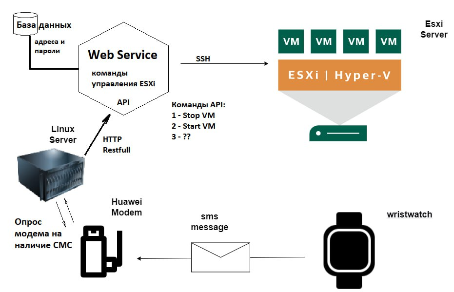

# Sms-Manager
## Управление виртуалками в Vmware ESXI через смс

> Sms-Manager представляет собой набор скриптов, объединенных в демон непрерывно работающий в Linux, управление которым происходит с помощью смс.
> Смс пользователь отправляет с мобильного телефона, а принимает их типичный для таких сценариев [Huawei e3372h](https://market.yandex.ru/product--4g-lte-modem-huawei-e3372h-320/667862013?cpa=1) прошитый специальным образом
 
 
 ## Архитектура и принцип действия

> Смс отправляется с устройства типа умных часов нажатием кнопки сос на определенный номер, номер симкарты, которая установлена в модеме. Модем с помощью openvpn туннеля связан с сервером, через этот туннель, с помощью api модема смс менеджер через промежутки времени (30 сек по умолчанию, устанавливается в sms-diver.sh) производит опрос модема на предмет новых смс. При поступлении смс она проверяется на соответствие условиям - номеру/содержанию (все эти условия задаются как переменные в начале скрипта) и если она удовлетворяет условиям - на хост с ESXI по ssh отправляется команда о перезагрузке\остановке виртуальной машины.  

> На рисунке изображены связи участников схемы между собой

## Требования

Нам понадобится следующее:

1. Модем **Huawei e3372h-320** или **Huawei e3372h** но не в коем случае не **e3372s** 
2. Симкарта неважно с каким тарифом, главное чтобы смски доходили. У многих операторов есть тарифы для смарт-устройств
3. Сервер c Ubuntu Linux 20.04 и статическим IP, именно на нем будет выполняться sms-manager
4. Часы с кнопкой SOS, иницирующие отправку смс на модем
5. Данные пользователя на хост с Vmware ESXI, имеющего права на перезагрузку виртуальных машин

## Установка

Установка sms-manager состоит из нескольких вещей:

- [Прошивка модема](firmware/README.md)
- [Настройка сервера](server/README.md)
- [Тестирование](test/README.md)
